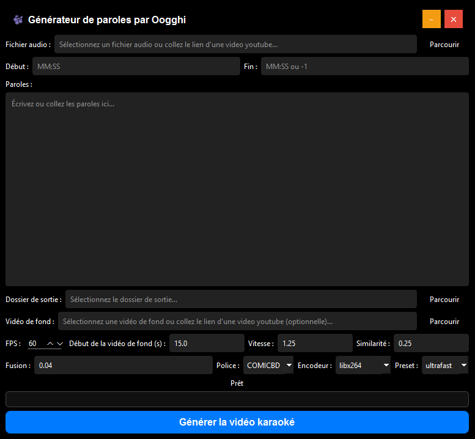

# 🎶 Lyrics Generator by Oogghi

PyQt6 application to create karaoke videos with automatic lyrics synchronization and visual effects.

## ✨ Features

- **Automatic lyrics synchronization** with audio via ForceAlign
- **Multi-format support**: MP3, WAV, FLAC, M4A, MP4, MOV, AVI
- **Built-in YouTube download** for audio and background video
- **Audio trimming** with timecodes (MM:SS or H:MM:SS)
- **Video overlay** with customizable chroma key effect
- **Modern interface** with custom title bar
- **Automatic settings saving**
- **Optimized encoding** (CPU/GPU: NVIDIA, AMD, Intel)

## 🛠️ Installation

### Requirements
- Python 3.8+
- FFmpeg installed and accessible in PATH
- Optional GPU for accelerated encoding

### Dependencies
- Installed at first launch

### Project Structure
├── main.py # Main interface
├── align_whisperx.py # Synchronization module
├── generate_vid.py # Lyrics video generation
├── chroma_video.py # Chroma key overlay
├── fonts/ # Fonts folder (.ttf/.otf)
│ └── COMICBD.ttf # Default font
├── songs/ # Audio files folder
└── settings.json # Saved settings

## 🚀 Usage

1. **Launch the application**
   - Click "start.bat"

2. **Configure the project**
   - Select an audio file or paste a YouTube link
   - Optional: set start/end (e.g., `1:30` to `3:45`)
   - Enter or paste lyrics into the text box
   - Choose output folder

3. **Background video (optional)**
   - Select a local video or YouTube link
   - Adjust chroma key settings if needed

4. **Advanced settings**
   - **FPS**: Frames per second (default: 60)
   - **Background video start**: start point in seconds
   - **Speed**: speed multiplier (1.25 = 125%)
   - **Similarity/Blending**: chroma key settings
   - **Font**: choose from fonts in `fonts/`
   - **Encoder**: choose CPU or GPU based on your hardware

5. **Generate**
   - Click "Generate karaoke video"
   - Follow progress in status bar

## 📁 Generated files

For each project, the application creates:
- `[name]_trimmed.mp3` - Trimmed audio
- `[name].lrc` - Synchronization file
- `[name]_lyrics.mp4` - Lyrics-only video
- `[name]_final.mp4` - Final video with background (if applicable)

## ⚙️ Technical settings

### Supported encoders
- **CPU**: libx264, libx265, mpeg4, vp8, vp9, av1
- **NVIDIA**: h264_nvenc, hevc_nvenc
- **AMD**: h264_amf, hevc_amf
- **Intel**: h264_qsv, hevc_qsv

### Quality presets
`ultrafast` → `veryslow` (speed vs quality)

### Accepted timecode formats
- `MM:SS` or `M:SS` (e.g., `1:30`, `12:45`)
- `H:MM:SS` (e.g., `1:12:30`)
- `-1` for "until the end"

## 🎨 Customization

### Adding fonts
1. Place `.ttf` or `.otf` files in the `fonts/` folder
2. Restart the application
3. Font will appear in dropdown

### Chroma key settings
- **Similarity** (0.0-1.0): sensitivity of green detection
- **Blending** (0.0-1.0): edge smoothness
- **Speed**: controls background video speed

## 🔧 Troubleshooting

### "❌ Audio/video download error"
- Check internet connection
- Ensure YouTube URL is valid and public

### "❌ Audio trimming error"
- Check that audio file is not corrupted
- Ensure FFmpeg is installed

### Slow performance
- Use a faster preset (`ultrafast`)
- Lower FPS for testing

## 📋 Example usage

Audio : https://www.youtube.com/watch?v=dQw4w9WgXcQ
Start : 0:15
End : 3:30
Lyrics :
First line of the song
Second line with timing
Third and final line

Background video : https://www.youtube.com/watch?v=dQw4w9WgXcQ
Settings : FPS=60, Speed=1.25, Font=COMICBD

## 🤝 Contribution

Contributions are welcome! Feel free to:
- Report bugs via Issues
- Suggest improvements
- Submit Pull Requests

## 📧 Contact

Created by **Oogghi**

---

*Modern interface with custom title bar and automatic settings saving*
