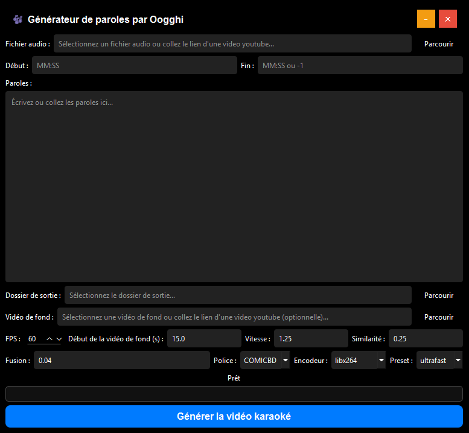

# 🎶 Générateur de paroles par Oogghi

Application PyQt6 pour créer des vidéos karaoké avec synchronisation automatique des paroles et effets visuels.



## ✨ Fonctionnalités

- **Synchronisation automatique** des paroles avec l'audio via WhisperX
- **Support multi-formats** : MP3, WAV, FLAC, M4A, MP4, MOV, AVI
- **Téléchargement YouTube** intégré pour audio et vidéo de fond
- **Découpage audio** avec timecodes (MM:SS ou H:MM:SS)
- **Superposition vidéo** avec effet chroma key personnalisable
- **Interface moderne** avec barre de titre personnalisée
- **Sauvegarde automatique** des paramètres
- **Encodage optimisé** (CPU/GPU : NVIDIA, AMD, Intel)

## 🛠️ Installation

### Prérequis
- Python 3.8+
- FFmpeg installé et accessible dans le PATH
- GPU optionnel pour l'encodage accéléré

### Dépendances
- Au lancement !

### Structure du projet
```
├── main.py                 # Interface principale
├── align_whisperx.py      # Module de synchronisation
├── generate_vid.py        # Génération vidéo lyrics
├── chroma_video.py        # Superposition chroma key
├── fonts/                 # Dossier des polices (.ttf/.otf)
│   └── COMICBD.ttf       # Police par défaut
├── songs/                 # Dossier des sons
└── settings.json         # Paramètres sauvegardés
```

## 🚀 Utilisation

1. **Lancer l'application**
   - Cliquer sur "start.bat"

2. **Configurer le projet**
   - Sélectionner un fichier audio ou coller un lien YouTube
   - Optionnel : définir début/fin (ex: `1:30` à `3:45`)
   - Saisir ou coller les paroles dans la zone de texte
   - Choisir le dossier de sortie

3. **Vidéo de fond (optionnel)**
   - Sélectionner une vidéo locale ou lien YouTube
   - Ajuster les paramètres de chroma key si nécessaire

4. **Paramètres avancés**
   - **FPS** : Fréquence d'images (défaut: 60)
   - **Début vidéo de fond** : Point de départ en secondes
   - **Vitesse** : Multiplicateur de vitesse (1.25 = 125%)
   - **Similarité/Fusion** : Réglages chroma key
   - **Police** : Choisir parmi les polices du dossier `fonts/`
   - **Encodeur** : Sélectionner CPU ou GPU selon votre matériel

5. **Génération**
   - Cliquer sur "Générer la vidéo karaoké"
   - Suivre la progression dans la barre de statut

## 📁 Fichiers générés

Pour chaque projet, l'application crée :
- `[nom]_trimmed.mp3` - Audio découpé
- `[nom].lrc` - Fichier de synchronisation
- `[nom]_lyrics.mp4` - Vidéo avec paroles seules
- `[nom]_final.mp4` - Vidéo finale avec fond (si applicable)

## ⚙️ Paramètres techniques

### Encodeurs supportés
- **CPU** : libx264, libx265, mpeg4, vp8, vp9, av1
- **NVIDIA** : h264_nvenc, hevc_nvenc
- **AMD** : h264_amf, hevc_amf
- **Intel** : h264_qsv, hevc_qsv

### Presets de qualité
`ultrafast` → `veryslow` (vitesse vs qualité)

### Formats timecode acceptés
- `MM:SS` ou `M:SS` (ex: `1:30`, `12:45`)
- `H:MM:SS` (ex: `1:12:30`)
- `-1` pour "jusqu'à la fin"

## 🎨 Personnalisation

### Ajouter des polices
1. Placer les fichiers `.ttf` ou `.otf` dans le dossier `fonts/`
2. Redémarrer l'application
3. La police apparaîtra dans la liste déroulante

### Paramètres chroma key
- **Similarité** (0.0-1.0) : Sensibilité de détection du vert
- **Fusion** (0.0-1.0) : Douceur des bords
- **Vitesse** : Contrôle la vitesse de la vidéo de fond

## 🔧 Dépannage

### "❌ Erreur téléchargement audio/vidéo"
- Vérifier la connexion internet
- S'assurer que l'URL YouTube est valide et publique

### "❌ Erreur découpe audio"
- Vérifier que le fichier audio n'est pas corrompu
- S'assurer que FFmpeg est installé

### Performance lente
- Utiliser un preset plus rapide (`ultrafast`)
- Même sur les ordinateurs plus lents, c'est censé être rapide !
- Réduire les FPS pour les tests

## 📋 Exemple d'utilisation

```
Audio : https://www.youtube.com/watch?v=dQw4w9WgXcQ
Début : 0:15
Fin : 3:30
Paroles : 
    Première ligne de la chanson
    Deuxième ligne avec timing
    Troisième ligne finale

Vidéo de fond : https://www.youtube.com/watch?v=dQw4w9WgXcQ
Paramètres : FPS=60, Vitesse=1.25, Police=COMICBD
```

## 🤝 Contribution

Les contributions sont bienvenues ! N'hésitez pas à :
- Signaler des bugs via les Issues
- Proposer des améliorations
- Soumettre des Pull Requests

## 📧 Contact

Créé par **Oogghi**

---

*Interface moderne avec barre de titre personnalisée et sauvegarde automatique des paramètres*